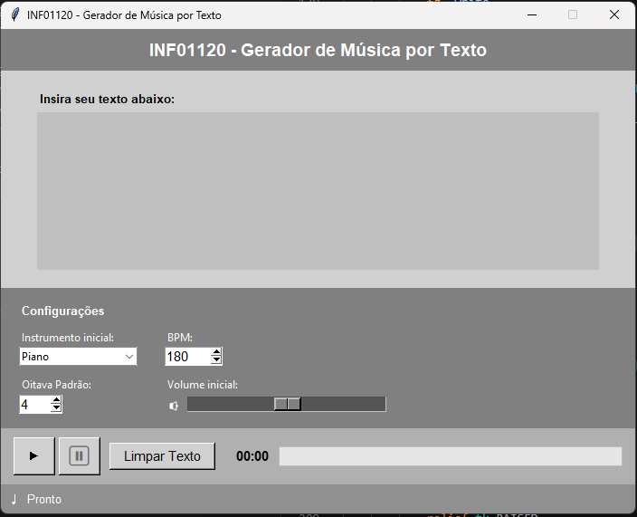

# Capturas da Interface Grafica

Registro visual dos estados da interface grafica do Gerador de Musica por Texto.

As imagens estao em `docs/fase1/img/`.

---

## 1. Estado inicial

Janela ao ser aberta, antes de qualquer interacao.

Valores padrao:
- Instrumento: Piano
- BPM: 180
- Oitava: 4
- Volume: meio do slider
- Status: Pronto
- Botao pause desabilitado

---

## 2. Erro — texto vazio

Dialogo exibido ao clicar em play com o campo de texto vazio.

---

## 3. Erro — audio nao configurado

Dialogo exibido ao clicar em play sem FluidSynth instalado ou sem `SOUNDFONT_PATH` configurado.

